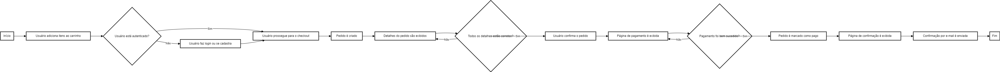

<div align="center">
  <h1>DSCommerce API</h1>
  <p>Aplicação desenvolvida utilizando a API do GitHub, para realizar busca de usuários, utilizando a lib axios para requisições e respostas.</p>
  
</div>

# 📒 Índice
* [Descrição](#descrição)
* [Requisitos Funcionais](#requisitos)
  * [Features](#features)
* [Tecnologias](#tecnologias)
* [Endpoints](#endpoints)
* [Instalação](#instalação)
* [Licença](#licença)

# 📃 <span id="descrição">Descrição</span>
Aplicação desenvolvida utilizando a API do [**GitHub**](https://docs.github.com/pt/rest/guides/getting-started-with-the-rest-api), para realizar busca de usuários, utilizando a lib [**axios**](https://github.com/axios/axios) para requisições e respostas.

# 📌 <span id="requisitos">Requisitos Funcionais</span>
- [x] Validação de usuários<br>
- [x] Consulta e exibição dos dados do usuários<br>
- [x] Salva os dados do usuário<br>
- [x] Mostra vacinas obrigatórias<br>

## Features
- [x] Adicionando mapeamento de CORS<br>
- [x] Modelo de domínio complexo<br>
- [x] Projeção com SQL nativo<br>
- [x] Ambientes diferentes de desenvolvimento: DEV, TEST, PROD<br>

# 💻 <span id="tecnologias">Tecnologias</span>
- **Java**
- **Spring**
- **Spring Web**
- **Spring Boot DevTools**
- **Spring Data JPA**
- **OAuth2 Resource Server**
- **BCrypt**
- **JWT**
- **MySQL**
- **H2 Database**

# 📍 <span id="endpoints">Endpoints</span>
| Endpoint               | Resumo                                          | Autenticação
|----------------------|-----------------------------------------------------|----------------------
| <kbd>GET /products </kbd> | Responsável por listar todos os produtos | Não
| <kbd>GET /products/:id </kbd> | Responsável por exibir um produto especifico por seu ID | Não
| <kbd>POST /products </kbd> | Responsável por cadastrar um produto | ROLE_ADMIN
| <kbd>PUT /products/:id </kbd> | Responsável por atualizar um produto, informando o ID no Path e via corpo de requisição as informações | ROLE_ADMIN
| <kbd>PUT /products/:id </kbd> | Responsável por deletar um produto, informando o ID no Path | ROLE_ADMIN
| <kbd>GET /h2-console </kbd> | Responsável por acesso ao *H2 Database*

# 🚀 <span id="instalação">Instalação</span>
```bash
  # Clone este repositório:
  $ git clone https://github.com/CleilsonAndrade/dscommerce-api.git
  $ cd ./dscommerce-api

  # Instalar as dependências:
  $ mvn clean instal

  # Executar:
  $ mvn spring-boot:run
```

# 📝 <span id="licença">Licença</span>
Esse projeto está sob a licença MIT. Veja o arquivo [LICENSE](LICENSE) para mais detalhes.

---

<p align="center">
  Feito com 💜 by CleilsonAndrade
</p>