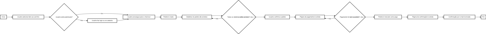

<div align="center">
  <h1>DSCommerce API</h1>
  <p>DSCommerce API é uma API robusta e versátil que atende às necessidades tanto de administradores quanto de clientes, para o gerenciamento de um sistema comercial. Oferece recursos como autenticação de usuário, perfis de usuário, gerenciamento de produtos com categorias, geração de ordem de compra e consulta. Foi utilizado o framework do Java o Spring, Spring Web, para gerenciamento do web server, Spring Data JPA para manipulação de informações dos bancos de dados MySQL e H2 Database. Para segurança e autenticação foi utilizado tecnologias como OAuth2 Resource Server, JWT e BCrypt.</p>
  
</div>

# 📒 Índice
* [Descrição](#descrição)
* [Requisitos Funcionais](#requisitos)
  * [Features](#features)
* [Tecnologias](#tecnologias)
* [Endpoints](#endpoints)
* [Instalação](#instalação)
* [Licença](#licença)

# 📃 <span id="descrição">Descrição</span>
DSCommerce API é uma API robusta e versátil que atende às necessidades tanto de administradores quanto de clientes, para o gerenciamento de um sistema comercial. Oferece recursos como autenticação de usuário, perfis de usuário, gerenciamento de produtos com categorias, geração de ordem de compra e consulta. Foi utilizado o framework do [**Java**](https://www.java.com) o [**Spring**](https://spring.io), [**Spring Web**](https://spring.io/projects/spring-framework), para gerenciamento do web server, [**Spring Data JPA**](https://spring.io/projects/spring-data-jpa) para manipulação de informações dos bancos de dados [**MySQL**](https://www.mysql.com) e [**H2 Database**](https://www.h2database.com). Para segurança e autenticação foi utilizado tecnologias como [**OAuth2 Resource Server**](https://oauth.net/2/), [**JWT**](https://jwt.io) e [**BCrypt**](https://en.wikipedia.org/wiki/Bcrypt) com a utilização da criptografia do tipo RSA.

# 📌 <span id="requisitos">Requisitos Funcionais</span>
- [x] Autenticação de usuário<br>
- [x] Perfis de cliente e administrador associados ao usuário<br>
- [x] Cadastramento de produtos e categoria pertencente, por usuário com perfil de administrador<br>
- [x] Listagem de produtos<br>
- [x] Consulta de um produto especifico<br>
- [x] Atualização de informações de produtos, por usuário com perfil de administrador<br>
- [x] Deleção de um produto especifico, por usuário com perfil de administrador<br>
- [x] Listagem de todas as categorias<br>
- [x] Gerar ordem de compra, por usuário com perfil de cliente<br>
- [x] Consulta de ordem de compra especifica, por usuário com perfis cliente e administrador<br>

## Features
- [x] Autenticação de usuário utilizando OAuth2, chave RSA e JWT Token<br>
- [x] Exibição de informações do próprio usuário em sessão ativa<br>
- [x] Status para as ordens: AGUARDANDO PAGAMENTO, PAGO, ENVIADO, ENTREGUE, CANCELADO<br>
- [x] Adicionando mapeamento de CORS<br>
- [x] Modelo de domínio complexo<br>
- [x] Projeção com SQL nativo<br>
- [x] Ambientes diferentes de desenvolvimento: DEV, TEST, PROD<br>

# 💻 <span id="tecnologias">Tecnologias</span>
- **Java**
- **Spring**
- **Spring Web**
- **Spring Boot DevTools**
- **Spring Data JPA**
- **OAuth2 Resource Server**
- **RSA**
- **JWT**
- **BCrypt**
- **MySQL**
- **H2 Database**

# 📍 <span id="endpoints">Endpoints</span>
| Endpoint               | Resumo                                          | Autenticação               | Role
|----------------------|-----------------------------------------------------|--------------------------|----------------------
| <kbd>POST /oauth2/token </kbd> | Responsável por autenticar usuário e gerar o Bearer Token JWT. Utiliza o *Basic Auth* e o corpo de requisição do tipo *x-www-form-urlencoded* com as chaves: *username*, *password* e *grant_type* | Sim | *
| <kbd>GET /users/me </kbd> | Responsável por listar as informações do usuário que esta na sessão | Sim | ROLE_ADMIN, ROLE_CLIENT
| <kbd>GET /products </kbd> | Responsável por listar todos os produtos | Não | *
| <kbd>GET /products/:id </kbd> | Responsável por exibir um produto especifico por seu ID | Não | *
| <kbd>POST /products </kbd> | Responsável por cadastrar um produto | Sim | ROLE_ADMIN
| <kbd>PUT /products/:id </kbd> | Responsável por atualizar um produto, informando o ID no Path e via corpo de requisição as informações | Sim | ROLE_ADMIN
| <kbd>PUT /products/:id </kbd> | Responsável por deletar um produto, informando o ID no Path | Sim | ROLE_ADMIN
| <kbd>GET /categories </kbd> | Responsável por listar todos as categorias | Não | *
| <kbd>POST /orders </kbd> | Responsável por gerar uma ordem de uma compra | Sim | ROLE_CLIENT
| <kbd>GET /orders/:id </kbd> | Responsável por listar os produtos na ordem de uma compra especifica e seu status, informando o ID | Sim | ROLE_ADMIN, ROLE_CLIENT
| <kbd>GET /h2-console </kbd> | Responsável por acesso ao *H2 Database* | Sim | *

# 🚀 <span id="instalação">Instalação</span>
```bash
  # Clone este repositório:
  $ git clone https://github.com/CleilsonAndrade/dscommerce-api.git
  $ cd ./dscommerce-api

  # Instalar as dependências:
  $ mvn clean install

  # Executar:
  $ mvn spring-boot:run
```

# 📝 <span id="licença">Licença</span>
Esse projeto está sob a licença MIT. Veja o arquivo [LICENSE](LICENSE) para mais detalhes.

---

<p align="center">
  Feito com 💜 by CleilsonAndrade
</p>
